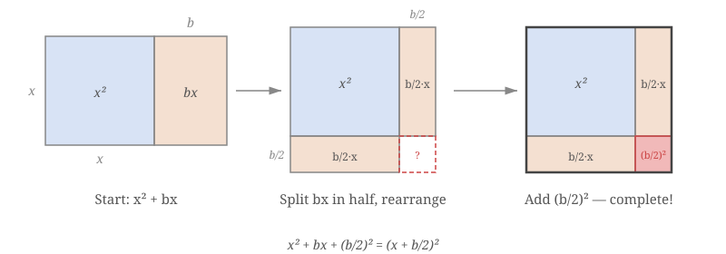

# Completing the Square 配方法

## Definition

**Completing the square** (配方法) rewrites a quadratic expression $ax^2 + bx + c$ as a squared bracket plus a constant:

$$ax^2 + bx + c \;=\; a(x + p)^2 + q$$

The squared bracket $(x + p)^2$ is the "completed square," and $q$ is whatever correction is needed to balance the identity. It is one of the most powerful algebraic techniques at IGCSE Extension level — it derives the quadratic formula, reveals the vertex of a parabola, and unlocks exact irrational roots.

### 中文锚点

配方法 = 把一个二次式写成"完全平方 + 常数"的形式。$x^2 + bx$ 加上 $\left(\dfrac{b}{2}\right)^2$ 就能凑成 $(x + \dfrac{b}{2})^2$。是推导求根公式的核心技术。

---

## §1 Geometric Intuition — How al-Khwarizmi Invented Algebra

The name "algebra" comes from the Arabic word **al-jabr** (الجبر), meaning *restoration* or *reunion of broken parts*. It was coined by the Persian mathematician **Muḥammad ibn Mūsā al-Khwārizmī** (c. 780–850 CE) in his book *Al-Kitāb al-mukhtaṣar fī ḥisāb al-jabr wa-l-muqābala* ("The Compendious Book on Calculation by Completion and Balancing"), written around 820 CE. His name is also the root of the word **algorithm**. Al-Khwarizmi's central technique for solving quadratics was — quite literally — completing a square with geometric tiles.

### The classical picture

Consider $x^2 + bx$, drawn as a square and a rectangle:

$$\begin{array}{c} \text{square } x^2 \quad + \quad \text{rectangle } bx \end{array}$$

**Step 1 — Split the rectangle in half.** The $bx$ rectangle splits into two strips of size $\dfrac{b}{2} \times x$.

**Step 2 — Reposition.** Place one strip along the right edge of the square and the other along the bottom. The resulting shape is an L — almost a square, but with a missing corner.

**Step 3 — Complete the square.** The missing corner is a tiny square of side $\dfrac{b}{2}$, with area $\left(\dfrac{b}{2}\right)^2$. **Add it in** — this is the "completing" step. The whole shape is now a square of side $x + \dfrac{b}{2}$, with area $\left(x + \dfrac{b}{2}\right)^2$.

### The algebraic identity

Because we added $\left(\dfrac{b}{2}\right)^2$ that wasn't there originally, we must subtract it back to keep the identity true:

$$x^2 + bx \;=\; \left(x + \dfrac{b}{2}\right)^2 - \left(\dfrac{b}{2}\right)^2$$

This is the heart of the method. Every completing-the-square problem is just this one identity, applied carefully.

> [!tip] The rule in one sentence
> **Halve the coefficient of $x$, square it, add and subtract it.**

---

## §2 The Algorithm — Monic Quadratic (when $a = 1$)

For $x^2 + bx + c$:

**Step 1.** Take half the coefficient of $x$: $\;\dfrac{b}{2}$.

**Step 2.** Write the squared bracket: $\;\left(x + \dfrac{b}{2}\right)^2$.

**Step 3.** Expand it mentally: $\;x^2 + bx + \dfrac{b^2}{4}$.

**Step 4.** Compare with the original. The $x^2 + bx$ matches; the constant term is off by $\dfrac{b^2}{4} - c$. Subtract the excess and add the original constant:

$$x^2 + bx + c \;=\; \left(x + \dfrac{b}{2}\right)^2 - \dfrac{b^2}{4} + c$$

### Example — $x^2 + 6x + 11$

Half of $6$ is $3$. So:

$$x^2 + 6x + 11 \;=\; (x + 3)^2 - 9 + 11 \;=\; (x + 3)^2 + 2$$

**Check by expanding:** $(x+3)^2 + 2 = x^2 + 6x + 9 + 2 = x^2 + 6x + 11$. ✓

### Example — $x^2 - 8x + 3$

Half of $-8$ is $-4$. So:

$$x^2 - 8x + 3 \;=\; (x - 4)^2 - 16 + 3 \;=\; (x - 4)^2 - 13$$

> [!warning] Sign mistake alert
> Students often forget that the coefficient $-8$ halves to $-4$, not $4$, and write $(x+4)^2$ instead of $(x-4)^2$. Keep the sign. Halving changes the magnitude, not the sign.

---

## §3 Non-Monic Quadratic (when $a \neq 1$)

For $ax^2 + bx + c$ with $a \neq 1$, **factor out $a$ from the first two terms only**, complete the square inside, then multiply back in.

### Example — $2x^2 + 12x + 5$

**Step 1 — Factor out $a = 2$ from the quadratic and linear terms only:**

$$2x^2 + 12x + 5 \;=\; 2(x^2 + 6x) + 5$$

**Step 2 — Complete the square inside the bracket** (half of $6$ is $3$):

$$x^2 + 6x \;=\; (x + 3)^2 - 9$$

**Step 3 — Substitute back and distribute the $2$:**

$$2\left[(x + 3)^2 - 9\right] + 5 \;=\; 2(x + 3)^2 - 18 + 5 \;=\; 2(x + 3)^2 - 13$$

**Check:** $2(x+3)^2 - 13 = 2(x^2 + 6x + 9) - 13 = 2x^2 + 12x + 18 - 13 = 2x^2 + 12x + 5$. ✓

> [!warning] Don't forget to multiply the $-9$ back by $2$
> The most common mistake in non-monic problems is forgetting that the $-\dfrac{b^2}{4}$ was *inside* the factored bracket and therefore gets multiplied by $a$ when you distribute. Writing $2(x+3)^2 - 9 + 5$ instead of $2(x+3)^2 - 18 + 5$ loses the mark.

---

## §4 Deriving the Quadratic Formula — The Crown Jewel

The quadratic formula didn't fall from the sky. It is **completing the square applied to the general quadratic** $ax^2 + bx + c = 0$, with letters instead of numbers. This is the most important derivation at IGCSE Extension level — and the first time most students see *where* the formula comes from.

**Starting point:** $\;ax^2 + bx + c = 0$, with $a \neq 0$.

**Step 1 — Divide through by $a$** to make the quadratic monic:

$$x^2 + \dfrac{b}{a}\,x + \dfrac{c}{a} = 0$$

**Step 2 — Move the constant to the right:**

$$x^2 + \dfrac{b}{a}\,x = -\dfrac{c}{a}$$

**Step 3 — Complete the square on the left.** Half of $\dfrac{b}{a}$ is $\dfrac{b}{2a}$. Add $\left(\dfrac{b}{2a}\right)^2 = \dfrac{b^2}{4a^2}$ to **both sides**:

$$x^2 + \dfrac{b}{a}\,x + \dfrac{b^2}{4a^2} \;=\; \dfrac{b^2}{4a^2} - \dfrac{c}{a}$$

**Step 4 — Write the left side as a squared bracket:**

$$\left(x + \dfrac{b}{2a}\right)^2 \;=\; \dfrac{b^2}{4a^2} - \dfrac{c}{a}$$

**Step 5 — Combine the right side over a common denominator $4a^2$:**

$$\left(x + \dfrac{b}{2a}\right)^2 \;=\; \dfrac{b^2}{4a^2} - \dfrac{4ac}{4a^2} \;=\; \dfrac{b^2 - 4ac}{4a^2}$$

**Step 6 — Take the square root of both sides** (remember **$\pm$** — see warning below):

$$x + \dfrac{b}{2a} \;=\; \pm\,\dfrac{\sqrt{b^2 - 4ac}}{2a}$$

**Step 7 — Solve for $x$:**

$$\boxed{\;x \;=\; \dfrac{-b \pm \sqrt{b^2 - 4ac}}{2a}\;}$$

That's it. The quadratic formula is completing the square with letters. Every time you use the formula to solve a quadratic, you are using al-Khwarizmi's 12-century-old geometric trick.

> [!warning] The $\pm$ is non-negotiable
> When you take a square root, there are **two** solutions: one positive, one negative. Writing only $\dfrac{\sqrt{b^2 - 4ac}}{2a}$ loses half the roots. The $\pm$ appears because $\sqrt{x^2}$ is $|x|$, not $x$. Never drop it.

### The discriminant falls out for free

The quantity $b^2 - 4ac$ inside the square root is called the **discriminant** (判别式, pànbié shì), often written $\Delta$ (capital Greek delta).

> [!info] Why "discriminant"? The root meaning of the word
> In English, the verb "to discriminate" unfortunately carries a heavy modern association with prejudice and civil rights violations. But its **original, neutral meaning** — the one mathematicians use — is simply *"to distinguish between things; to tell them apart."* It comes from the Latin *discriminare* (to separate, to divide), from *discrimen* (a division, a distinction, a turning point). The same Latin root gives us *discern* and *discernment*.
>
> The Chinese 判别式 preserves this neutral meaning perfectly: **判** (pàn) = to judge, to decide; **别** (bié) = to distinguish, to differentiate. A 判别式 is literally "a judging-distinguishing expression" — a formula whose **value tells you which of several cases you're in**.
>
> That is exactly what $b^2 - 4ac$ does. It *discriminates* between three cases, without you having to find the roots themselves:

| Discriminant | Case | What the graph looks like |
|---|---|---|
| $\Delta > 0$ | Two distinct real roots | Parabola crosses the $x$-axis at **two** points |
| $\Delta = 0$ | One repeated real root | Parabola **touches** the $x$-axis at exactly one point (vertex on the axis) |
| $\Delta < 0$ | No real roots | Parabola never touches the $x$-axis |

The geometric meaning comes for free once you see the formula derived this way: where the parabola meets the $x$-axis is exactly where $y = 0$, which is where the quadratic equation has solutions.

> [!tip] Beyond the syllabus — when $\Delta < 0$, a whole new world opens up
> What does it mean for a quadratic to have "no real roots"? Look at the formula again:
>
> $$x = \dfrac{-b \pm \sqrt{b^2 - 4ac}}{2a}$$
>
> When $b^2 - 4ac < 0$, you are being asked to take the square root of a **negative number**. Inside the real number system $\mathbb{R}$, this has no answer — no real number squared gives a negative.
>
> But this is **not** the end of the story. Mathematicians of the 16th century (Cardano, Bombelli) refused to give up. They defined a new object $i$ — the **imaginary unit** — satisfying $i^2 = -1$. Once you accept $i$ as a legitimate number, every quadratic has roots. The solutions live in a bigger number system called the **complex numbers** $\mathbb{C}$, where each number has the form $a + bi$ (a real part plus an imaginary part).
>
> The name **"imaginary"** is a historical accident — a slur thrown by Descartes, who thought these numbers were fictional. They are not. Complex numbers are **as real as negative numbers** (which also took centuries to be accepted — medieval European mathematicians once called them *"absurd numbers"*). Today, complex numbers are the working language of:
>
> - **Electrical engineering** — AC circuits are analysed using complex impedance
> - **Quantum mechanics** — the wavefunction $\psi$ is inherently complex-valued
> - **Signal processing** — the Fourier transform uses $e^{i\omega t}$
> - **Fluid dynamics, control theory, computer graphics** — and much more
>
> **For your 9260 exam:** when $\Delta < 0$, write "no real roots" — that is what the mark scheme expects at IGCSE level. Do **not** write "no solutions" or "impossible" — the roots exist, they just live in a number system you haven't formally met yet.
>
> **Where you'll meet them:** Cambridge A-Level Further Mathematics, IB AA HL, AP Precalculus (briefly) and AP Calculus BC, and year 1 of any STEM undergraduate degree. Look forward to it — complex numbers are one of the most beautiful ideas in mathematics.

---

## §5 Applications

### 5.1 — Vertex form and the turning point of a parabola

If you complete the square on $y = ax^2 + bx + c$ and get:

$$y \;=\; a(x - h)^2 + k$$

then the parabola has its **vertex** (turning point) at $(h, k)$. No calculus needed.

**Example:** Find the minimum value of $y = x^2 - 6x + 10$.

$$y \;=\; (x - 3)^2 - 9 + 10 \;=\; (x - 3)^2 + 1$$

Since $(x - 3)^2 \geq 0$ for all $x$, the minimum of $y$ is $1$, attained when $x = 3$. Vertex: $(3, 1)$.

> [!tip] Why vertex form is beautiful
> Vertex form tells you **where the parabola is** (the vertex) and **which way it opens** (sign of $a$) at a glance. Standard form $ax^2 + bx + c$ tells you the $y$-intercept $c$, but you'd need calculus or $-\dfrac{b}{2a}$ to find the vertex. Completing the square gives it for free. This connects directly to [[Stationary Points]].

### 5.2 — Solving equations with irrational roots

Use completing the square (or the formula) when factorising fails.

**Example:** Solve $x^2 + 4x - 1 = 0$.

$$x^2 + 4x = 1 \;\Rightarrow\; (x + 2)^2 - 4 = 1 \;\Rightarrow\; (x + 2)^2 = 5$$

$$x + 2 = \pm\sqrt{5} \;\Rightarrow\; x = -2 \pm \sqrt{5}$$

The answers are **exact surd forms**. This is where [[Surds]] and completing the square meet — a problem that can't be solved by factorisation alone.

### 5.3 — Proving a quadratic is always positive (or negative)

To show $x^2 + 2x + 5 > 0$ for all real $x$:

$$x^2 + 2x + 5 \;=\; (x + 1)^2 + 4$$

Since $(x+1)^2 \geq 0$, we have $(x+1)^2 + 4 \geq 4 > 0$ for all $x$. $\square$

This is a classic [[Algebraic Proof]] technique — completing the square transforms the question "is this positive?" into "is this a sum of a square and a positive number?"

---

## §6 Worked Examples

### Example 1 — Monic, integer constants

Express $x^2 + 10x + 21$ in the form $(x + p)^2 + q$.

Half of $10$ is $5$:

$$(x + 5)^2 - 25 + 21 \;=\; (x + 5)^2 - 4$$

So $p = 5$, $q = -4$.

### Example 2 — Monic, negative linear term

Express $x^2 - 12x + 40$ in the form $(x + p)^2 + q$.

Half of $-12$ is $-6$:

$$(x - 6)^2 - 36 + 40 \;=\; (x - 6)^2 + 4$$

So $p = -6$, $q = 4$. Minimum value is $4$, at $x = 6$.

### Example 3 — Non-monic, positive leading coefficient

Express $3x^2 + 18x - 5$ in the form $a(x + p)^2 + q$.

$$3x^2 + 18x - 5 \;=\; 3(x^2 + 6x) - 5 \;=\; 3\left[(x + 3)^2 - 9\right] - 5 \;=\; 3(x + 3)^2 - 27 - 5 \;=\; 3(x + 3)^2 - 32$$

So $a = 3$, $p = 3$, $q = -32$.

### Example 4 — Non-monic, negative leading coefficient

Express $-x^2 + 6x + 2$ in the form $a(x + p)^2 + q$.

Factor out $-1$ from the quadratic and linear terms:

$$-x^2 + 6x + 2 \;=\; -(x^2 - 6x) + 2 \;=\; -\left[(x - 3)^2 - 9\right] + 2 \;=\; -(x - 3)^2 + 9 + 2 \;=\; -(x - 3)^2 + 11$$

The parabola opens **downward** ($a = -1 < 0$), so $(3, 11)$ is a **maximum**.

### Example 5 — Solve by completing the square

Solve $2x^2 - 8x + 3 = 0$ exactly.

$$2(x^2 - 4x) + 3 = 0 \;\Rightarrow\; 2\left[(x - 2)^2 - 4\right] + 3 = 0 \;\Rightarrow\; 2(x - 2)^2 - 5 = 0$$

$$(x - 2)^2 = \dfrac{5}{2} \;\Rightarrow\; x - 2 = \pm\sqrt{\dfrac{5}{2}} \;\Rightarrow\; x = 2 \pm \dfrac{\sqrt{10}}{2}$$

Rationalising $\sqrt{\frac{5}{2}} = \dfrac{\sqrt{5}}{\sqrt{2}} = \dfrac{\sqrt{10}}{2}$ (from [[Surds]]).

### Example 6 — Showing a quadratic has no real roots

Show that $x^2 + 4x + 7 = 0$ has no real solutions.

$$x^2 + 4x + 7 \;=\; (x + 2)^2 - 4 + 7 \;=\; (x + 2)^2 + 3$$

Since $(x + 2)^2 \geq 0$, the expression is always $\geq 3 > 0$, so it can never equal zero. No real roots. $\square$

(Equivalently: discriminant $= 16 - 28 = -12 < 0$. Both methods agree.)

---

## §7 Common Mistakes

1. **Sign error when halving.** $x^2 - 8x \Rightarrow (x - 4)^2 - 16$, NOT $(x + 4)^2 - 16$. The sign of the linear term survives halving.

2. **Forgetting to subtract $\left(\dfrac{b}{2}\right)^2$.** Writing $x^2 + 6x + 11 = (x+3)^2 + 11$ is wrong — you must subtract the $9$ you silently added: $(x+3)^2 - 9 + 11$.

3. **Non-monic: not multiplying the $-\left(\dfrac{b}{2}\right)^2$ by $a$.** After $2[(x+3)^2 - 9]$, the $-9$ must become $-18$ when you distribute. This is the #1 cause of lost marks at 9260 Extension.

4. **Dropping the $\pm$ when taking square roots.** $(x - 2)^2 = 5$ gives $x - 2 = \pm\sqrt{5}$, so *two* solutions. Writing only $x = 2 + \sqrt{5}$ loses half the answer.

5. **Not simplifying surds in the final answer.** $x = 2 \pm \sqrt{\dfrac{5}{2}}$ should be written $x = 2 \pm \dfrac{\sqrt{10}}{2}$ — rationalise the denominator. 9260 mark schemes typically require surd form.

6. **Applying the monic algorithm directly to a non-monic.** $2x^2 + 12x + 5 \neq (2x + 6)^2 - 36 + 5$. You must factor $a$ out first, or keep it inside carefully. Mixing the two approaches is a recipe for sign errors.

7. **Factoring $a$ out of the constant term by accident.** In $2x^2 + 12x + 5$, you factor $2$ from $2x^2 + 12x$ only, leaving the $+5$ alone: $2(x^2 + 6x) + 5$. Writing $2(x^2 + 6x + \frac{5}{2})$ is technically valid but makes the arithmetic messy.

---

## §8 Exam Notes

### OxAQA 9260

**Syllabus ref:** A16 Extension — "Express quadratics in completed square form." A20 — "Solve quadratic equations by factorisation, completing the square, or formula." This is an **Extension-only** topic on 9260 — Core papers use factorisation and the formula only, but Extension papers frequently require students to either (a) complete the square explicitly, (b) find the vertex via completing the square, or (c) derive the quadratic formula from scratch.

**Typical 9260 Extension questions:**

- "Express $x^2 + 8x + 3$ in the form $(x + p)^2 + q$, where $p$ and $q$ are integers."
- "Hence write down the minimum value of $x^2 + 8x + 3$ and the value of $x$ at which it occurs."
- "Show that $x^2 - 6x + 11 > 0$ for all real values of $x$."
- "Solve $3x^2 + 12x - 1 = 0$, giving your answers in the form $a \pm b\sqrt{c}$."
- "Show, by completing the square, that the solutions of $ax^2 + bx + c = 0$ are $x = \dfrac{-b \pm \sqrt{b^2 - 4ac}}{2a}$." *(This full derivation has appeared on past papers.)*

**Mark scheme patterns:** Marks are typically distributed as (1) factor $a$ out correctly, (2) halve $b$ correctly and square, (3) produce the completed square form, (4) simplify the constant. Partial credit is available even with arithmetic slips if the method is clear.

### Cambridge 0580 Extended

**Syllabus ref:** E2.5 #6 — "Solve quadratic equations by factorisation, completing the square and by use of the quadratic formula. *Includes writing a quadratic expression in completed square form.*" On the 2025+ syllabus the technique is named outright, **Extended tier only** (it appears exactly once in the syllabus document, in the Extended column — Core candidates solve by factorisation and the given formula). Candidates may be asked for solutions in surd form; the quadratic formula is printed in the List of formulas, the completed-square method is not.

### Cambridge 0606

**Syllabus ref:** 2.3 — "Find maximum or minimum values of a quadratic function by completing the square." This is a core 0606 technique and appears in almost every exam cycle. 0606 students are explicitly expected to find vertex form and identify max/min.

### Cambridge 9709 (A-Level)

**Syllabus ref:** Paper 1 §1.1 (Quadratics) — "carry out the process of completing the square for a quadratic polynomial $ax^2 + bx + c$ and use a completed square form", e.g. to locate the vertex or sketch the graph; solving quadratics (and quadratic inequalities) "by factorising, completing the square and using the formula" is listed alongside. Far from assumed knowledge, this is an explicitly examined P1 process — the classic ask is "express in the form $a(x + p)^2 + q$, hence state the range of $f$" feeding straight into the §1.2 functions work (range, and showing a restricted quadratic is one-one for the inverse).

### Edexcel IAL / OxAQA 9660

Both IAL boards examine it in their first pure unit. **Edexcel IAL P1 §1.5**: "Completing the square. Solution of quadratic equations" — solving "by factorisation, use of the formula, use of a calculator and completing the square". **OxAQA 9660 P1.1**: "Completing the square" is its own listed row (with the spec's own examples $x^2 + 6x - 1 = (x+3)^2 - 10$ and a non-monic), beside "quadratic functions and their graphs — vertex and line of symmetry", which is exactly what the completed square delivers.

### AP / IB

At AP Precalculus and IB AA/AI the technique itself is assumed rather than freshly examined, but it keeps reappearing as the tool inside later topics:

- **Integration** — turning $\int \dfrac{dx}{x^2 + 2x + 5}$ into $\int \dfrac{dx}{(x+1)^2 + 4}$, which is an $\arctan$ integral.
- **Conic sections** — writing circles, ellipses, hyperbolas in standard form requires completing the square on both $x$ and $y$.
- **Eigenvalues** — solving a characteristic equation $\lambda^2 - (\operatorname{tr}\mathbf{A})\lambda + \det\mathbf{A} = 0$ exactly, at [[Eigenvalues and Eigenvectors]].

The technique you learn at IGCSE Extension is used for the next decade of mathematics. There is no mainstream board a student here will sit that leaves it out — only 0580 **Core** stops short of it.

---

## §9 Connections

- **Prerequisite:** [[Algebraic Expressions (Vocab)]] — terms, coefficients, the form $ax^2 + bx + c$
- **Prerequisite:** [[Expanding Brackets (Vocab)]] — you must be able to expand $(x + p)^2$ fluently to check your work
- **Prerequisite:** [[Factorising (Vocab)]] — knowing when factorisation fails tells you when to reach for completing the square
- **Prerequisite:** [[Laws of Indices]] — squaring and square-rooting use index laws
- **Prerequisite:** [[Surds]] — exact roots involve surd manipulation and rationalising
- **Leads to:** [[Quadratic Equations]] — one of three solution methods (factorise, formula, complete the square)
- **Leads to:** [[Sketching Curves (Vocab)\|Sketching Curves]] — vertex form gives the turning point for free
- **Leads to:** [[Stationary Points]] — calculus confirms what vertex form shows geometrically
- **Parallel:** [[Algebraic Proof]] — completing the square is a signature "show that … $> 0$" move
- **Parallel:** [[Pythagoras Theorem]] — both use the algebraic identity $(a + b)^2 = a^2 + 2ab + b^2$, and both have geometric proofs involving squares

---

## LaTeX Reference

| Symbol | LaTeX | Notes |
|--------|-------|-------|
| $\left(x + \dfrac{b}{2}\right)^2$ | `\left(x + \dfrac{b}{2}\right)^2` | The completed square; `\left` and `\right` auto-size brackets |
| $\pm$ | `\pm` | Plus-or-minus — **never** drop this when taking square roots |
| $\Delta$ | `\Delta` | Discriminant $b^2 - 4ac$ |
| $\sqrt{b^2 - 4ac}$ | `\sqrt{b^2 - 4ac}` | Square root of the discriminant |
| $\dfrac{-b \pm \sqrt{b^2 - 4ac}}{2a}$ | `\dfrac{-b \pm \sqrt{b^2 - 4ac}}{2a}` | The quadratic formula |
