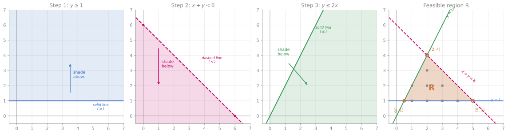

# Graphical Inequalities 图示不等式

## Definition

A **graphical inequality** takes a linear inequality like $y < 2x + 1$ and represents it as a **region** on the coordinate plane — the set of all points $(x, y)$ that satisfy the inequality. The boundary line divides the plane into two half-planes; you shade the one you want (or the one you don't — read the question carefully).

### 中文锚点

图示不等式 = 在坐标平面上用区域表示不等式的解集。画出边界线（直线），然后判断哪一侧满足条件，标记该区域。虚线 = 不包含边界；实线 = 包含边界。

---

## Key Vocabulary

| English | 中文 | Notes |
|---------|------|-------|
| boundary line | 边界线 (biānjiè xiàn) | The line $y = mx + c$ that forms the edge of the region |
| dashed line | 虚线 (xūxiàn) | Strict inequality ($<$ or $>$) — points **on** the line are not included |
| solid line | 实线 (shíxiàn) | Weak inequality ($\leq$ or $\geq$) — points on the line **are** included |
| region | 区域 (qūyù) | The set of points satisfying the inequality |
| shade | 涂色 (tú sè) | Mark the region; check whether the question says "shade the region" or "shade the unwanted region" |
| satisfy | 满足 (mǎnzú) | A point satisfies an inequality if it makes it true |
| feasible region | 可行域 (kěxíng yù) | The region satisfying **all** inequalities at once (used in optimisation / linear programming) |

---

## The Method

**Step 1 — Draw the boundary line.** Treat the inequality as an equation: $y = 2x + 1$. Plot it. Use a **dashed line** for $<$ or $>$, **solid line** for $\leq$ or $\geq$.

**Step 2 — Test a point.** Pick any point not on the line — $(0, 0)$ is almost always the easiest (unless the line passes through the origin). Substitute into the inequality:

$$y < 2x + 1 \;\Rightarrow\; 0 < 2(0) + 1 \;\Rightarrow\; 0 < 1 \quad \text{✓ True}$$

So $(0, 0)$ is in the solution region — shade the side that contains the origin.

**Step 3 — Shade.** Read the question: "shade the region satisfying…" means shade the wanted side. "Shade the region that does **not** satisfy…" or "indicate the unwanted region" means shade the opposite side, leaving the solution region clear.

> [!tip] WHY does testing one point work?
> A line splits the plane into exactly two half-planes. Every point in the same half-plane gives the same truth value for the inequality (because the expression $y - 2x - 1$ is continuous and doesn't change sign without crossing zero, which only happens on the line). So one test point decides the entire half-plane.

### Worked Example — Multiple inequalities

When a question gives 2–3 inequalities, draw all boundary lines and identify the region that satisfies **all** of them simultaneously. The overlap region is the answer — this is "simultaneous inequalities," the graphical cousin of [[Simultaneous Equations (Vocab)]].

**Example:** Shade the region R satisfying all three inequalities:

$$y \geq 1 \qquad x + y < 6 \qquad y \leq 2x$$

Notice the mix: two weak inequalities ($\geq$, $\leq$) and one strict ($<$). The strict inequality gets a **dashed** boundary line — points on that line are not in R.

**Step 1 — Draw $y \geq 1$.** **Solid** horizontal line at $y = 1$ (weak inequality — boundary included). Test $(0, 3)$: $3 \geq 1$ ✓, so shade **above** the line.

**Step 2 — Draw $x + y < 6$,** i.e. $y < -x + 6$. **Dashed** line through $(0, 6)$ and $(6, 0)$ (strict inequality — boundary **not** included). Test $(0, 0)$: $0 + 0 = 0 < 6$ ✓, so shade **below** the line.

**Step 3 — Draw $y \leq 2x$.** **Solid** line through the origin with gradient $2$. Test $(3, 1)$: $1 \leq 6$ ✓, so shade **below** the line (the side away from the $y$-axis).

**Step 4 — Find R.** The feasible region is where all three shaded areas overlap — a triangle with vertices:

| Intersection | How | Vertex | Included? |
|---|---|---|---|
| $y = 1$ meets $y = 2x$ | $1 = 2x \Rightarrow x = \tfrac{1}{2}$ | $(\tfrac{1}{2},\; 1)$ | ● Yes — both lines solid |
| $y = 1$ meets $x + y = 6$ | $x = 5$ | $(5,\; 1)$ | ○ No — on dashed line |
| $y = 2x$ meets $x + y = 6$ | $2x + x = 6 \Rightarrow x = 2$ | $(2,\; 4)$ | ○ No — on dashed line |

In the diagram, solid dots (●) mark included vertices; open dots (○) mark excluded ones. The small grey squares mark the **8 integer points** in R: $(1,1)$, $(1,2)$, $(2,1)$, $(2,2)$, $(2,3)$, $(3,1)$, $(3,2)$, $(4,1)$. Note that $(2, 4)$ and $(5, 1)$ are **not** included — they sit on the dashed line $x + y = 6$, and the strict inequality $<$ excludes the boundary.

A follow-up question might ask "List the points with integer coordinates in R" or "Find the maximum value of $3x + 2y$ in R" (which leads to [[Linear Programming]] at A-Level).

---

## Common Mistakes

1. **Dashed vs solid confusion.** $y < 2x + 1$ → dashed. $y \leq 2x + 1$ → solid. The line itself is part of the solution only with $\leq$ or $\geq$.
2. **Shading the wrong side.** Always test a point. Don't guess from the inequality sign — rearranging changes which side is "above" or "below."
3. **Shading wanted vs unwanted.** Read the instruction word for word. Cambridge often says "shade the **unwanted** region" so the answer region is left clear and readable. 9260 may say either.
4. **Forgetting vertical/horizontal boundaries.** $x \geq 1$ is a vertical line at $x = 1$, shading to the right. $y \leq 5$ is a horizontal line at $y = 5$, shading below.

---

## Exam Notes

### Cambridge 0580

**Syllabus ref: E2.6.3** (the prose here previously said E2.9 — the PDF says E2.6): "represent and interpret linear inequalities in two variables graphically," with the syllabus's own three conventions, each worth a mark when ignored: **broken lines** for strict inequalities, **solid lines** for inclusive ones, and **shading for the *unwanted* regions** unless the question directs otherwise — so the default is now fixed, not variable. One boundary worth knowing loudly: **linear programming was removed from the 2025–27 Extended syllabus** (it is on the official content-removed list) — the classic "find integer points in the feasible region and optimise $2x+y$" question is no longer asked at 0580; *represent and interpret* is the whole task.

### OxAQA 9260

**Syllabus ref: A23 Extension.** The fuller shape survives here: draw the lines, identify the region, and work with points inside it. Read the shading instruction every time — 9260 does not fix a default the way 0580 now does.

---

## Connections

- **Prerequisite:** [[Linear Inequalities (Vocab)]] — 1D inequalities on a number line; the sign-flip rule still applies when rearranging
- **Prerequisite:** [[Equation of a Straight Line (Vocab)]] — boundary lines are straight lines; you need $y = mx + c$ fluency
- **Prerequisite:** [[Linear Graphs (Vocab)]] — plotting the boundary line accurately
- **Parallel:** [[Simultaneous Equations (Vocab)]] — solving two equations = finding intersection points; solving two inequalities = finding intersection regions
- **Leads to:** Linear Programming (A-Level / IB) — optimising an objective function over a feasible region defined by inequalities
