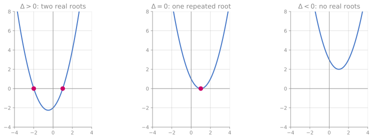

# Quadratic Equations 二次方程

## Definition

A **quadratic equation** is any equation that can be written in the form

$$ax^2 + bx + c = 0, \qquad a \neq 0$$

where $a$, $b$, $c$ are constants. The word **quadratic** comes from the Latin *quadrātus*, meaning *squared* — because the highest power of $x$ is $x^2$ (a square). The condition $a \neq 0$ is essential: if $a = 0$ the $x^2$ term vanishes and you have a linear equation.

A quadratic equation has **at most two solutions** (also called *roots*). Finding those roots is one of the most-tested skills at IGCSE and beyond.

### 中文锚点

二次方程 = 含 $x^2$ 的方程，最高次数为 2。标准形式 $ax^2 + bx + c = 0$。"二次"就是"平方"。三种解法：因式分解、配方法、求根公式。

---

## §1 Three Solution Methods — and When to Use Each

Every quadratic can be solved by the quadratic formula. But the formula isn't always the fastest or the most elegant path. You have three tools; the skill is choosing the right one.

### 1.1 Factorising 因式分解

If the quadratic factorises neatly over the integers, this is the fastest method — and the one examiners expect you to try first.

**Core principle — the zero-product property:** If $AB = 0$, then $A = 0$ or $B = 0$ (or both). This innocent-looking fact is what makes factorising work. It only works when one side is exactly zero — which is why you must always rearrange to $= 0$ first.

> [!tip] WHY does the zero-product property hold?
> Suppose $AB = 0$ but $A \neq 0$. Then $A$ has a multiplicative inverse $A^{-1}$, and multiplying both sides by it gives $B = A^{-1} \cdot 0 = 0$. So at least one of $A$ or $B$ must be zero. This argument works in any structure where there are no **zero divisors** — the integers, rationals, reals, and complex numbers all have this property. It fails in modular arithmetic (e.g., $2 \times 3 = 0 \pmod{6}$), which is why factorising doesn't always work in $\mathbb{Z}_n$.

**Example:** Solve $x^2 - 5x + 6 = 0$.

Find two numbers that multiply to $6$ and add to $-5$: that's $-2$ and $-3$.

$$x^2 - 5x + 6 = (x - 2)(x - 3) = 0$$

So $x = 2$ or $x = 3$.

**Example (non-monic):** Solve $6x^2 + x - 2 = 0$.

Using the cross method (see [[Factorising (Vocab)]]):

$$6x^2 + x - 2 = (2x - 1)(3x + 2) = 0$$

So $x = \dfrac{1}{2}$ or $x = -\dfrac{2}{3}$.

### 1.2 Completing the Square 配方法

When the roots are **irrational** (surds) or when you need the **vertex** of the parabola, completing the square gives exact answers and geometric insight. The full technique is in [[Completing the Square]]; here we use it as a solving method.

**Example:** Solve $x^2 + 6x + 2 = 0$.

$$(x + 3)^2 - 9 + 2 = 0 \;\Rightarrow\; (x+3)^2 = 7 \;\Rightarrow\; x = -3 \pm \sqrt{7}$$

The $\pm$ is non-negotiable — two roots.

### 1.3 The Quadratic Formula

The formula is completing the square done once, with letters, so you never have to do it again:

$$\boxed{\;x = \dfrac{-b \pm \sqrt{b^2 - 4ac}}{2a}\;}$$

See [[Completing the Square]] §4 for the full derivation — the formula didn't fall from the sky; it is al-Khwarizmi's 1200-year-old geometric trick written in symbols.

**Example:** Solve $3x^2 - 7x + 1 = 0$.

$a = 3$, $b = -7$, $c = 1$:

$$x = \dfrac{7 \pm \sqrt{49 - 12}}{6} = \dfrac{7 \pm \sqrt{37}}{6}$$

### 1.4 Decision Framework — Which Method When?

| Situation | Best method | Why |
|-----------|-------------|-----|
| Small integer coefficients, looks factorisable | Factorise | Fastest; examiners expect it |
| Question says "by completing the square" | Complete the square | Must use stated method |
| Question says "giving your answer in the form $p \pm \sqrt{q}$" | Complete the square or formula | Both give surd form |
| Nasty coefficients, no obvious factors | Formula | Works on everything |
| Need to find the vertex / prove always positive | Complete the square | Gives vertex form directly |
| $b = 0$ (no linear term): $ax^2 + c = 0$ | Rearrange directly: $x^2 = -c/a$ | No formula or factoring needed |
| $c = 0$ (no constant): $ax^2 + bx = 0$ | Factor out $x$: $x(ax + b) = 0$ | One root is always $x = 0$ |

---

## §2 The Discriminant 判别式

The expression $\Delta = b^2 - 4ac$ (the quantity under the square root in the formula) tells you **how many real roots** the equation has — without solving it. It *discriminates* between cases (see [[Completing the Square]] §4 for the etymology).

| Discriminant | Roots | Geometry |
|---|---|---|
| $\Delta > 0$ | Two distinct real roots | Parabola crosses the $x$-axis twice |
| $\Delta = 0$ | One repeated root (a.k.a. equal roots) | Parabola touches the $x$-axis at its vertex |
| $\Delta < 0$ | No real roots | Parabola never meets the $x$-axis |

> [!tip] WHY does the discriminant work?
> The formula says $x = \dfrac{-b \pm \sqrt{\Delta}}{2a}$. The $\pm$ produces two answers only if $\sqrt{\Delta}$ is a nonzero real number ($\Delta > 0$). If $\Delta = 0$, the $\pm$ gives $\pm 0$ — both branches collapse to the same answer. If $\Delta < 0$, the square root asks for $\sqrt{\text{negative}}$, which has no answer in $\mathbb{R}$.

**Example:** For what values of $k$ does $x^2 + kx + 9 = 0$ have equal roots?

Equal roots means $\Delta = 0$: $k^2 - 4(1)(9) = 0 \;\Rightarrow\; k^2 = 36 \;\Rightarrow\; k = \pm 6$.

**Example:** Show that $2x^2 - 3x + 4 = 0$ has no real roots.

$\Delta = (-3)^2 - 4(2)(4) = 9 - 32 = -23 < 0$. Since $\Delta < 0$, no real roots. $\square$

> [!info] What happens when $\Delta < 0$?
> The roots still exist — they are **complex numbers** of the form $a + bi$, where $i = \sqrt{-1}$. At 9260, write "no real roots." See [[Completing the Square]] §4 for the full story of imaginary numbers.

---

## §3 Vieta's Formulas — The Roots Tell You Everything

There is a beautiful connection between a quadratic's coefficients and its roots that doesn't require solving the equation at all.

If $\alpha$ and $\beta$ are the roots of $ax^2 + bx + c = 0$, then:

$$\alpha + \beta = -\dfrac{b}{a} \qquad \qquad \alpha\beta = \dfrac{c}{a}$$

### WHY this works — proof in two lines

Since $\alpha$ and $\beta$ are roots, $ax^2 + bx + c = a(x - \alpha)(x - \beta)$. Expand the right side:

$$a(x - \alpha)(x - \beta) = a\left[x^2 - (\alpha + \beta)x + \alpha\beta\right] = ax^2 - a(\alpha+\beta)x + a\cdot\alpha\beta$$

Matching coefficients with $ax^2 + bx + c$:

$$b = -a(\alpha + \beta) \;\Rightarrow\; \alpha + \beta = -\dfrac{b}{a}$$

$$c = a \cdot \alpha\beta \;\Rightarrow\; \alpha\beta = \dfrac{c}{a}$$

These are **Vieta's formulas**, named after François Viète (1540–1603), the French mathematician who first used letters systematically for unknowns — essentially inventing the algebraic notation we use today.

> [!tip] The monic shortcut
> For the common case $x^2 + bx + c = 0$ (where $a = 1$): **sum of roots = $-b$**, **product of roots = $c$**. Just read the coefficients.

### 3.1 Forming Equations from Roots

Vieta's formulas work in reverse. If you know the roots are $\alpha$ and $\beta$, the equation is:

$$x^2 - (\alpha + \beta)x + \alpha\beta = 0$$

**Example:** Form a quadratic equation with roots $3$ and $-5$.

Sum $= 3 + (-5) = -2$. Product $= 3 \times (-5) = -15$.

$$x^2 - (-2)x + (-15) = 0 \;\Rightarrow\; x^2 + 2x - 15 = 0$$

**Example:** One root of $x^2 - 7x + k = 0$ is $2$. Find $k$ and the other root.

By Vieta: sum of roots $= 7$, so the other root $= 7 - 2 = 5$. Product of roots $= k$, so $k = 2 \times 5 = 10$.

(Check: $x^2 - 7x + 10 = (x-2)(x-5) = 0$. ✓)

---

## §4 Applications — Word Problems

Quadratic equations appear whenever a quantity depends on its own square. The key skill is **translation**: turning words into $ax^2 + bx + c = 0$.

### Example 1 — Area problem

> A rectangle has length $3$ cm more than its width. Its area is $70$ cm². Find the dimensions.

Let width $= x$. Then length $= x + 3$.

$$x(x + 3) = 70 \;\Rightarrow\; x^2 + 3x - 70 = 0 \;\Rightarrow\; (x + 10)(x - 7) = 0$$

$x = -10$ (reject — length can't be negative) or $x = 7$.

Width $= 7$ cm, length $= 10$ cm.

> [!warning] Always check whether both roots make sense in context
> Quadratic equations often give one root that is mathematically valid but physically meaningless (negative length, negative time, fractional people). State the rejection and why.

### Example 2 — Projectile (vertical throw)

> A ball is thrown vertically upward. Its height $h$ metres after $t$ seconds is $h = 20t - 5t^2$. When does the ball hit the ground?

Ground means $h = 0$:

$$20t - 5t^2 = 0 \;\Rightarrow\; 5t(4 - t) = 0 \;\Rightarrow\; t = 0 \text{ or } t = 4$$

$t = 0$ is the launch moment. The ball hits the ground at $t = 4$ seconds.

> [!tip] WHY the $5t^2$?
> The term $-5t^2$ comes from $-\dfrac{1}{2}gt^2$ where $g \approx 10$ m/s². This is kinematics — the constant acceleration equation $s = ut + \dfrac{1}{2}at^2$ with $u = 20$ and $a = -10$ (gravity acts downward). Every projectile question is secretly a quadratic.

### Example 3 — Number puzzle

> Two positive numbers differ by $3$ and their product is $108$. Find them.

Let the smaller number be $x$. Then the larger is $x + 3$.

$$x(x + 3) = 108 \;\Rightarrow\; x^2 + 3x - 108 = 0$$

$\Delta = 9 + 432 = 441 = 21^2$. So $x = \dfrac{-3 + 21}{2} = 9$ (taking the positive root).

The numbers are $9$ and $12$.

---

## §5 Common Mistakes

1. **Dividing by $x$ instead of factoring.** Given $x^2 = 5x$, students divide both sides by $x$ to get $x = 5$ — losing the root $x = 0$. Rearrange to $x^2 - 5x = 0$, then $x(x - 5) = 0$. **Never divide by a variable that could be zero.**

2. **Wrong sign substitution in the formula.** For $3x^2 - 7x + 2 = 0$, students write $b = 7$ instead of $b = -7$. The formula has $-b$, so $-(-7) = +7$. Write down $a = \ldots$, $b = \ldots$, $c = \ldots$ separately before substituting — this one habit prevents half of all formula errors.

3. **Dividing only part of the numerator by $2a$.** Writing $x = \dfrac{-b}{2a} \pm \sqrt{b^2 - 4ac}$ instead of $x = \dfrac{-b \pm \sqrt{b^2 - 4ac}}{2a}$. The **entire** numerator is divided by $2a$, not just $-b$.

4. **Forgetting to rearrange to $= 0$ before factorising.** Given $(x+1)(x-3) = 5$, you cannot say "$x + 1 = 5$ or $x - 3 = 5$." The zero-product property requires zero on the right. Expand, rearrange, refactor.

5. **Rejecting valid negative roots without reason.** $x = -3$ is a perfectly good root if the context allows negative values (e.g., temperature, coordinates). Only reject when the context demands positivity (lengths, counts, times).

6. **Calculator rounding when surds are expected.** If the question says "exact form" or "in the form $p \pm q\sqrt{r}$," a decimal answer scores zero. Leave in surd form and simplify.

---

## §6 Exam Notes

### OxAQA 9260

**Syllabus ref:** A20 — "Solve quadratic equations by factorisation, completing the square, or the formula." Core-level questions typically use factorisation only. Extension questions add completing the square and the formula, and may ask for discriminant analysis or forming equations from given roots.

**Typical 9260 questions:**

- "Solve $x^2 - 8x + 15 = 0$." [Factorise — 2 marks]
- "Solve $2x^2 + 5x - 3 = 0$, giving your answers as fractions." [Formula or cross-method — 3 marks]
- "The equation $x^2 + px + 12 = 0$ has equal roots. Find the possible values of $p$." [Discriminant — 3 marks]
- "The length of a rectangle is $(x+5)$ cm and the width is $(x-2)$ cm. The area is $60$ cm². Form and solve an equation to find $x$." [Word problem — 4 marks]

**Mark scheme patterns:** Marks split as (1) correct equation / rearrangement, (2) correct method (factorise / formula / CTS), (3) both solutions, (4) rejection + answer in context for word problems.

### Cambridge 0580 Extended

**Syllabus ref:** E2.7 — "Solve quadratic equations by factorisation, completing the square or by use of the formula." Same three methods as 9260. Discriminant analysis is less explicitly tested than on 9260 but can appear in "show that this equation has no solutions."

### Cambridge 0606

**Syllabus ref:** 2.2 — "Solve quadratic equations for real roots." 0606 additionally expects: (a) forming quadratics from given roots using sum/product, (b) conditions for real/complex roots via discriminant, (c) maximum/minimum problems using completed square form.

### Cambridge 9709 (A-Level Mathematics) — **Paper 1, §1.1 Quadratics**

Quadratics open the A-Level syllabus and carry five named learning objectives — this was missing from the card until 2026-08-13:

- **complete the square** for $ax^2+bx+c$ and *use* the completed form — to locate the vertex or sketch the graph;
- **find and use the discriminant**, e.g. to determine the number of real roots. The term **"repeated root"** is explicitly included;
- **solve quadratic equations *and quadratic inequalities*** in one unknown, by factorising, completing the square, or the formula;
- **solve by substitution a pair of simultaneous equations** of which one is linear and one quadratic;
- **recognise and solve equations which are quadratic in some function of $x$** — the sneaky one, and the one students miss. The syllabus's own examples are $x^4 - 5x^2 + 4 = 0$, $x - 6\sqrt{x} + 1 = 0$ and $\tan^2 x = 1 + \tan x$: nothing announces itself as a quadratic, and spotting the disguise is the mark. [[Substitution Equations]] carries that technique.

The discriminant is by far the most examined of the five, usually as a *condition* rather than a calculation — "find the values of $k$ for which the line meets the curve twice" is a discriminant question wearing a geometry costume.

### Cambridge 9231 Further Mathematics — where the Vieta section leads

The Vieta section above is the **degree-2 case of a Further Pure 1 topic**. 9231 §1.1 removes the restriction on degree, extending $\alpha+\beta=-b/a$ to cubics and quartics and adding substitutions that transform the roots — see [[Symmetric Functions of Roots]]. Worth knowing while teaching it: the two relations here are not a quadratic trick, they are the first two of a general pattern, and students who learn them as a special case have to unlearn that later.

### Where this is *not* examined

Nothing here is beyond any of the boards covered — quadratics are universal. The **beyond-syllabus** material below (complex roots when $b^2-4ac<0$, the geometry of the discriminant) is examined only once [[Complex Numbers]] is available, which is A-Level and later.

---

## §7 Connections

- **Prerequisite:** [[Completing the Square]] — one of the three methods; derives the quadratic formula
- **Prerequisite:** [[Factorising (Vocab)]] — the fastest method when it works (HCF, DOTS, trinomial, cross method)
- **Prerequisite:** [[Expanding Brackets (Vocab)]] — checking factorisations; forming equations from roots
- **Prerequisite:** [[Surds]] — irrational roots require surd simplification and rationalisation
- **Leads to:** [[Simultaneous Equations (Vocab)|Simultaneous Equations]] — one linear + one quadratic is a 9260 Extension question type
- **Leads to:** [[Sketching Curves (Vocab)\|Sketching Curves]] — roots are the $x$-intercepts; discriminant tells you how many
- **Leads to:** [[Graphs of Functions]] — parabola shape, vertex, axis of symmetry, transformations
- **Leads to:** [[Trigonometric Equations]] — solving $\sin^2\theta + \sin\theta - 2 = 0$ is a "quadratic in disguise"
- **Parallel:** [[Algebraic Proof]] — discriminant arguments prove "always positive" or "no real roots"
- **Parallel:** [[Pythagoras Theorem]] — many Pythagorean problems generate quadratics

---

## Beyond Syllabus

### The Fundamental Theorem of Algebra

The pattern "degree $n$ polynomial has at most $n$ roots" isn't a coincidence. The **Fundamental Theorem of Algebra** (first proved by Gauss in 1799) says: every polynomial of degree $n$ with complex coefficients has **exactly $n$ roots** in $\mathbb{C}$ (counting multiplicity). A quadratic ($n = 2$) always has exactly two roots — when $\Delta < 0$, they are complex conjugates $a \pm bi$. The real number line simply can't see them.

This theorem is one of the deepest in mathematics: its proof requires either complex analysis, topology, or algebra far beyond school level. Yet its statement is simple enough to appreciate now.

### Cubic and Quartic Formulas

Al-Khwarizmi solved quadratics geometrically in the 9th century. In the 16th century, Italian mathematicians (Cardano, Tartaglia, Ferrari) found formulas for **cubics** ($ax^3 + bx^2 + cx + d = 0$) and **quartics** (degree 4). But the cubic formula involves cube roots of complex numbers even when all roots are real — a deeply unsettling discovery that forced mathematicians to take $\sqrt{-1}$ seriously.

In 1824, Abel proved there is **no general formula** for degree 5 and above (the Abel–Ruffini theorem). Galois (killed in a duel at age 20) then explained *why*: the symmetry group of a quintic is "too complex" to unravel with radicals. This launched **group theory**, one of the pillars of modern algebra.

The quadratic formula is the last "nice" formula. Enjoy it.

---

## LaTeX Reference

| Symbol | LaTeX | Notes |
|--------|-------|-------|
| $ax^2 + bx + c = 0$ | `ax^2 + bx + c = 0` | Standard form |
| $\dfrac{-b \pm \sqrt{b^2 - 4ac}}{2a}$ | `\dfrac{-b \pm \sqrt{b^2 - 4ac}}{2a}` | The quadratic formula |
| $\Delta = b^2 - 4ac$ | `\Delta = b^2 - 4ac` | Discriminant |
| $\alpha + \beta = -\dfrac{b}{a}$ | `\alpha + \beta = -\dfrac{b}{a}` | Vieta — sum of roots |
| $\alpha\beta = \dfrac{c}{a}$ | `\alpha\beta = \dfrac{c}{a}` | Vieta — product of roots |
