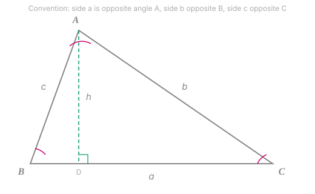
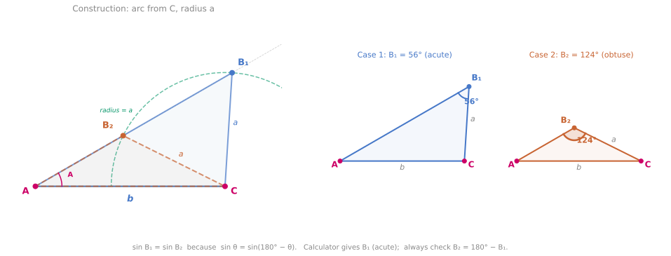
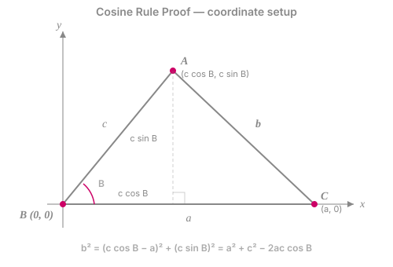
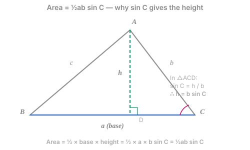

# Sine and Cosine Rules 正弦定理与余弦定理

## Definition

SOH-CAH-TOA only works in **right-angled** triangles. For **any** triangle — acute, obtuse, or right-angled — we need more powerful tools. The sine rule, cosine rule, and area formula are those tools. Together they solve every triangle problem at IGCSE and beyond.

### Notation convention

In any triangle $ABC$, the **lowercase** letter names the side **opposite** the uppercase angle:

- Side $a$ is opposite angle $A$ (i.e. $a = BC$)
- Side $b$ is opposite angle $B$ (i.e. $b = AC$)
- Side $c$ is opposite angle $C$ (i.e. $c = AB$)

### 中文锚点

正弦定理 = $\dfrac{a}{\sin A} = \dfrac{b}{\sin B} = \dfrac{c}{\sin C}$，用于"已知一对对边对角"的情况。

余弦定理 = $a^2 = b^2 + c^2 - 2bc\cos A$，是勾股定理的推广。当 $A = 90°$ 时，$\cos A = 0$，退化为 $a^2 = b^2 + c^2$。

面积公式 = $\text{面积} = \frac{1}{2}ab\sin C$，不需要知道高。

---

## §1 The Sine Rule 正弦定理

$$\boxed{\;\dfrac{a}{\sin A} = \dfrac{b}{\sin B} = \dfrac{c}{\sin C}\;}$$

Or equivalently, flipped:

$$\dfrac{\sin A}{a} = \dfrac{\sin B}{b} = \dfrac{\sin C}{c}$$

Use the first form when **finding a side** (sides on top), the second when **finding an angle** (sines on top).

### WHY — proof by dropping a perpendicular

Drop a perpendicular $h$ from vertex $A$ to side $BC$ (or $BC$ extended).

In the left right-angled triangle: $\sin B = \dfrac{h}{c}$, so $h = c\sin B$.

In the right right-angled triangle: $\sin C = \dfrac{h}{b}$, so $h = b\sin C$.

Both expressions equal $h$, so:

$$c\sin B = b\sin C \;\Rightarrow\; \dfrac{b}{\sin B} = \dfrac{c}{\sin C}$$

Drop a perpendicular from $B$ to side $AC$ and repeat the same argument to show $\dfrac{a}{\sin A} = \dfrac{c}{\sin C}$. Combining gives the full rule.

> [!tip] WHY the proof works for obtuse triangles too
> If angle $B$ is obtuse, the foot of the perpendicular from $A$ falls **outside** the triangle (on $BC$ extended). In that case, the right-angled triangle uses $\sin(180° - B) = \sin B$ — which is exactly the symmetry property from [[Trigonometric Functions]]. The algebra is identical.

> [!info] Beyond syllabus — the sine rule and the circumscribed circle
> The common value $\dfrac{a}{\sin A} = \dfrac{b}{\sin B} = \dfrac{c}{\sin C}$ is not just some abstract constant — it equals $2R$, where $R$ is the **circumradius** (the radius of the circle passing through all three vertices). This beautiful fact connects the sine rule to [[Circle Theorems I]]: the "angle at the circumference" theorem is essentially the sine rule in disguise. The proof uses the fact that the angle subtended by a chord at the centre is twice the angle at the circumference.

### 1.1 When to use the sine rule

You need a **matched pair** — a side and the angle opposite it — plus one more piece:

| Known | Find | Use |
|-------|------|-----|
| Two angles + one side (AAS or ASA) | The other side | Sine rule (find third angle first if needed: $A + B + C = 180°$) |
| Two sides + angle opposite one of them (SSA) | The angle opposite the other side | Sine rule — but **beware the ambiguous case** (§1.2) |

### 1.2 The ambiguous case

When you use the sine rule to find an angle, you compute $\sin B = \ldots$ and then take $B = \sin^{-1}(\ldots)$. But $\sin^{-1}$ only gives an **acute** answer (between $0°$ and $90°$). There might also be an **obtuse** angle with the same sine: $B' = 180° - B$.

This is called the **ambiguous case** (also SSA — "Side-Side-Angle"). It arises because two different triangles can share the same SSA data. To resolve it:

1. Compute $B = \sin^{-1}\!\left(\dfrac{b\sin A}{a}\right)$.
2. Check: is $B' = 180° - B$ also valid? (It's valid if $A + B' < 180°$.)
3. If both are valid, **there are two solutions** — state both.
4. If the question says "given that $B$ is obtuse" or the diagram makes it clear, only one solution applies.

> [!warning] The cosine rule has no ambiguous case
> The cosine rule gives a unique answer because $\cos^{-1}$ returns values in $[0°, 180°]$, covering both acute and obtuse angles. When in doubt, the cosine rule is the safer choice.

---

## §2 The Cosine Rule 余弦定理

$$\boxed{\;a^2 = b^2 + c^2 - 2bc\cos A\;}$$

By symmetry (relabelling): $b^2 = a^2 + c^2 - 2ac\cos B$ and $c^2 = a^2 + b^2 - 2ab\cos C$.

To find an angle, rearrange:

$$\cos A = \dfrac{b^2 + c^2 - a^2}{2bc}$$

### WHY — proof via coordinates (extended Pythagoras)

Place the triangle in the coordinate plane with $B$ at the origin and $C$ at $(a, 0)$. Then $A$ is at some point $(x, y)$.

From vertex $B$: $c^2 = x^2 + y^2$ (Pythagoras on the triangle $BOA$, where $O$ is the origin).

From vertex $C$: using [[Trigonometric Ratios]] on the triangle at $B$, we get $x = c\cos B$ and $y = c\sin B$.

Now compute $b^2 = AC^2 = (x - a)^2 + y^2$:

$$b^2 = (c\cos B - a)^2 + (c\sin B)^2$$

$$= c^2\cos^2 B - 2ac\cos B + a^2 + c^2\sin^2 B$$

$$= c^2(\cos^2 B + \sin^2 B) + a^2 - 2ac\cos B$$

$$= c^2 + a^2 - 2ac\cos B$$

which is the cosine rule (in the $b^2$ form). $\square$

> [!tip] The Pythagorean theorem is a special case
> When $A = 90°$, $\cos 90° = 0$, so the $-2bc\cos A$ term vanishes: $a^2 = b^2 + c^2$. The cosine rule **contains** [[Pythagoras Theorem]] as a special case — it's the same theorem, but for any angle instead of just $90°$. The extra term $-2bc\cos A$ is the "correction" for the angle not being right.

> [!tip] Geometric interpretation of the correction term
> When $A < 90°$ (acute), $\cos A > 0$, so $-2bc\cos A < 0$: the side opposite is **shorter** than Pythagoras would predict. When $A > 90°$ (obtuse), $\cos A < 0$, so $-2bc\cos A > 0$: the side opposite is **longer**. The cosine rule quantifies exactly how much the non-right angle distorts the Pythagorean relationship.

### The cosine rule is the dot product (A-Level)

In vector form, if $\mathbf{c} = \mathbf{a} - \mathbf{b}$, then $\lvert\mathbf{c}\rvert^2 = (\mathbf{a} - \mathbf{b}) \cdot (\mathbf{a} - \mathbf{b}) = \lvert\mathbf{a}\rvert^2 - 2\mathbf{a}\cdot\mathbf{b} + \lvert\mathbf{b}\rvert^2$. Since the **dot product** is defined as $\mathbf{a}\cdot\mathbf{b} = \lvert\mathbf{a}\rvert\lvert\mathbf{b}\rvert\cos\theta$, this is exactly the cosine rule. The cosine rule and the dot product are the **same theorem** in different languages — you'll meet this at A-Level in [[Vectors]] and again in university linear algebra.

### 2.1 When to use the cosine rule

| Known | Find | Use |
|-------|------|-----|
| Two sides + included angle (SAS) | The third side | $a^2 = b^2 + c^2 - 2bc\cos A$ directly |
| Three sides (SSS) | An angle | Rearranged form: $\cos A = \dfrac{b^2 + c^2 - a^2}{2bc}$ |

---

## §3 The Area Formula

$$\boxed{\;\text{Area} = \dfrac{1}{2}ab\sin C\;}$$

where $a$ and $b$ are **two sides** and $C$ is the **included angle** (the angle **between** them).

### WHY — proof

The standard area formula is $\text{Area} = \dfrac{1}{2} \times \text{base} \times \text{height}$. Take $a$ as the base. The height $h$ is the perpendicular from $A$ to side $BC$... but we don't know $h$ directly. Express it using trig:

$$\sin C = \dfrac{h}{b} \;\Rightarrow\; h = b\sin C$$

Substituting:

$$\text{Area} = \dfrac{1}{2} \times a \times b\sin C = \dfrac{1}{2}ab\sin C$$

By symmetry, any pair of sides works with the included angle: $\dfrac{1}{2}bc\sin A = \dfrac{1}{2}ac\sin B = \dfrac{1}{2}ab\sin C$.

> [!tip] WHY $\sin C$ and not $\cos C$?
> Height is **perpendicular** to the base. The perpendicular component of a vector at angle $C$ is always the **sine** component (think of resolving a force: the component perpendicular to a surface is $F\sin\theta$). This is why the area formula uses sin, not cos.

> [!warning] The angle must be the INCLUDED angle
> $\dfrac{1}{2}ab\sin C$ requires $C$ to be the angle between sides $a$ and $b$. Writing $\dfrac{1}{2}ab\sin A$ is **wrong** — $A$ is not between $a$ and $b$. The mnemonic: "two sides and the angle **sandwiched** between them."

---

## §4 Decision Framework — Which Rule When?

| Given | Goal | Rule | Why |
|-------|------|------|-----|
| 2 angles + 1 side (AAS/ASA) | Find a side | **Sine rule** | You have (or can get) a matched pair |
| 2 sides + opposite angle (SSA) | Find an angle | **Sine rule** | But watch for the ambiguous case |
| 2 sides + included angle (SAS) | Find the third side | **Cosine rule** | No matched pair available |
| 3 sides (SSS) | Find an angle | **Cosine rule** | No angles known, so sine rule can't start |
| 2 sides + included angle (SAS) | Find the area | **Area formula** | $\frac{1}{2}ab\sin C$ directly |

> [!tip] Quick rule of thumb
> If you have a **matched pair** (a side and its opposite angle), use the **sine rule**. If you don't, use the **cosine rule**.

---

## §5 Worked Examples

### Example 1 — Sine rule, finding a side (AAS)

> In triangle $ABC$, $A = 40°$, $B = 75°$, and $a = 12$ cm. Find $b$.

$C = 180° - 40° - 75° = 65°$.

$$\dfrac{b}{\sin 75°} = \dfrac{12}{\sin 40°} \;\Rightarrow\; b = \dfrac{12 \sin 75°}{\sin 40°} = \dfrac{12 \times 0.9659}{0.6428} = 18.0 \text{ cm (3 s.f.)}$$

### Example 2 — Cosine rule, finding a side (SAS)

> In triangle $PQR$, $p = 8$ cm, $q = 11$ cm, and $R = 50°$. Find $r$.

$$r^2 = p^2 + q^2 - 2pq\cos R = 64 + 121 - 2(8)(11)\cos 50° = 185 - 176(0.6428) = 185 - 113.1 = 71.9$$

$$r = \sqrt{71.9} = 8.48 \text{ cm (3 s.f.)}$$

### Example 3 — Cosine rule, finding an angle (SSS)

> A triangle has sides $5$ cm, $7$ cm, and $9$ cm. Find the largest angle.

The largest angle is opposite the longest side ($9$ cm). Call it $C$, with $a = 5$, $b = 7$, $c = 9$:

$$\cos C = \dfrac{a^2 + b^2 - c^2}{2ab} = \dfrac{25 + 49 - 81}{2(5)(7)} = \dfrac{-7}{70} = -0.1$$

$$C = \cos^{-1}(-0.1) = 95.7°$$

The negative cosine confirms: $C$ is obtuse.

### Example 4 — Area formula

> Two sides of a triangle are $6$ cm and $10$ cm with an included angle of $130°$. Find the area.

$$\text{Area} = \dfrac{1}{2}(6)(10)\sin 130° = 30 \times \sin 130° = 30 \times 0.7660 = 23.0 \text{ cm}^2$$

Note that $\sin 130° = \sin 50°$ (supplementary angles), so the formula works seamlessly for obtuse angles.

### Example 5 — The ambiguous case

> In triangle $ABC$, $A = 30°$, $a = 5$ cm, and $b = 8$ cm. Find the possible values of $B$.

$$\sin B = \dfrac{b \sin A}{a} = \dfrac{8 \times \sin 30°}{5} = \dfrac{8 \times 0.5}{5} = 0.8$$

$B_1 = \sin^{-1}(0.8) = 53.1°$ (acute).

$B_2 = 180° - 53.1° = 126.9°$ (obtuse).

Check: $A + B_2 = 30° + 126.9° = 156.9° < 180°$ ✓. Both are valid.

So there are **two possible triangles**: one with $B = 53.1°$, another with $B = 126.9°$.

---

## §6 Common Misconceptions

### 1. Wrong substitution into the cosine rule

Students write $a^2 = b^2 + c^2 - 2bc\cos A$ but substitute the wrong angle. Remember: the angle in the formula must be **opposite** the side on the left. $a^2$ goes with $\cos A$, $b^2$ goes with $\cos B$, $c^2$ goes with $\cos C$.

**Fix:** Before substituting, write "I'm finding side $\_$, so I need $\cos \_$ (the opposite angle)" as a verbal check.

### 2. Forgetting the minus sign in the cosine rule

Students write $a^2 = b^2 + c^2 + 2bc\cos A$ (plus instead of minus). This gives a completely wrong answer.

**Fix:** Think of the cosine rule as "Pythagoras **minus** a correction." The correction is $2bc\cos A$, and it's always subtracted. When the angle is obtuse, $\cos A$ is itself negative, so $-2bc\cos A$ becomes positive — the formula handles it automatically.

### 3. Using the wrong angle in the area formula

$\dfrac{1}{2}ab\sin C$ requires $C$ to be **between** sides $a$ and $b$. Students sometimes use an angle that's opposite one of the sides instead.

**Fix:** Draw the triangle, label the sides and angle you're given, and check: "Is the angle sandwiched between my two sides?" If not, either use a different pair or find the missing angle first.

### 4. Missing the second solution in the ambiguous case

When $\sin B = 0.8$, the calculator gives $B = 53.1°$. Students stop there. But $B = 126.9°$ is also valid if it fits the triangle.

**Fix:** Every time you use $\sin^{-1}$ to find an angle, **always** check $180° - B$. Only discard it if $A + (180° - B) \geq 180°$.

---

## §7 Exam Notes

### OxAQA 9260

**Syllabus ref:** G20 Extension — "Know and apply the sine rule, cosine rule, and $\text{Area} = \frac{1}{2}ab\sin C$." The formulae are given on the formula sheet. Extension papers frequently combine these with bearings, 3D trigonometry, or multi-step geometry. The ambiguous case is not explicitly tested at 9260 but can appear in harder problems.

**Typical 9260 questions:**

- "Find the length of $AC$" in a non-right triangle given SAS [3 marks]
- "Find the area of triangle $PQR$" given two sides and included angle [2 marks]
- "Find the largest angle" given SSS [3 marks]
- Multi-step: find a side using the cosine rule, then use it in the sine rule to find an angle [5–6 marks]

### Cambridge 0580 Extended

**Syllabus ref:** E6.6 — "Use the sine and cosine rules in calculations involving lengths and angles for any triangle. Area = $\frac{1}{2}ab\sin C$." Formulae are given. 0580 Extended papers test these routinely in Paper 4 (extended theory). Questions are similar to 9260 but rarely involve bearings or 3D.

### Cambridge 0606

**No subject-content row of its own.** The sine rule, the cosine rule and the area formula reach 0606 only through the **List of formulas** printed on page 2 of both papers — they are assumed from 0580 §6.6 and handed to you rather than taught again. That makes them sub-tools inside harder problems, which is exactly how they appear: a cosine-rule setup that produces a trigonometric equation to solve (Topic 10), or a triangle inside a circular-measure problem (Topic 9). Being given the formulas raises rather than lowers the bar — the marks are in choosing the right rule and handling the ambiguous case, which is more likely to be tested here than at 0580.

### A-Level

The sine rule, cosine rule, and area formula are assumed knowledge at A-Level. They reappear in:

- **Mechanics** — resolving forces in non-right triangles (Lami's theorem is essentially the sine rule applied to force triangles)
- **Further Pure** — proving identities and deriving results in triangle geometry
- **Statistics** — navigation/bearing problems in applied papers

The formulae are given on the A-Level formula sheet.

---

## §8 Connections

- **Prerequisite:** [[Trigonometric Ratios]] — SOH-CAH-TOA for right-angled triangles; the sine rule proof uses these directly
- **Prerequisite:** [[Trigonometric Functions]] — $\sin(180° - \theta) = \sin\theta$ justifies the obtuse case in both proofs
- **Prerequisite:** [[Pythagoras Theorem]] — the cosine rule is its direct generalisation
- **Prerequisite:** [[Surds]] — exact answers may require surd simplification
- **Leads to:** [[3D Trigonometry]] — applying these rules to triangles in three-dimensional figures
- **Leads to:** [[Vectors]] — the cosine rule = the dot product (see §2 above)
- **Leads to:** [[Circle Theorems I]] — the sine rule connects to the circumradius $2R$
- **Parallel:** [[Quadratic Equations]] — the cosine rule can produce a quadratic when finding a side given an angle and two other constraints

---

## Beyond Syllabus

### Heron's formula — area from three sides alone

Heron's formula is not required by any of the IGCSE, A-Level, or IB syllabuses, but it's a beautiful consequence of the tools you already have. For a triangle with sides $a, b, c$ and semi-perimeter $s = \frac{1}{2}(a+b+c)$:

$$\text{Area} = \sqrt{s(s-a)(s-b)(s-c)}$$

The derivation: use $\cos C = \frac{a^2 + b^2 - c^2}{2ab}$ (cosine rule), compute $\sin C = \sqrt{1 - \cos^2 C}$ (Pythagorean identity), substitute into $\frac{1}{2}ab\sin C$, and simplify. It's a satisfying algebraic exercise that ties together everything in this card. The elegance is that it needs **no angles at all** — pure side lengths determine the area.

### The sine rule in spherical geometry

On a sphere (the Earth's surface), the flat sine rule breaks down. The **spherical sine rule** replaces sides with arcs:

$$\dfrac{\sin a}{\sin A} = \dfrac{\sin b}{\sin B} = \dfrac{\sin c}{\sin C}$$

where $a, b, c$ are now **arc lengths** (in radians). This is the foundation of navigation and astronomy, and one reason [[Radians]] matter beyond pure mathematics.

---

## LaTeX Reference

| Symbol | LaTeX | Notes |
|--------|-------|-------|
| $\dfrac{a}{\sin A}$ | `\dfrac{a}{\sin A}` | Sine rule — sides on top for finding sides |
| $\dfrac{\sin A}{a}$ | `\dfrac{\sin A}{a}` | Sine rule — sines on top for finding angles |
| $a^2 = b^2 + c^2 - 2bc\cos A$ | `a^2 = b^2 + c^2 - 2bc\cos A` | Cosine rule — finding a side |
| $\cos A = \dfrac{b^2 + c^2 - a^2}{2bc}$ | `\cos A = \dfrac{b^2 + c^2 - a^2}{2bc}` | Cosine rule — finding an angle |
| $\dfrac{1}{2}ab\sin C$ | `\dfrac{1}{2}ab\sin C` | Area formula |
